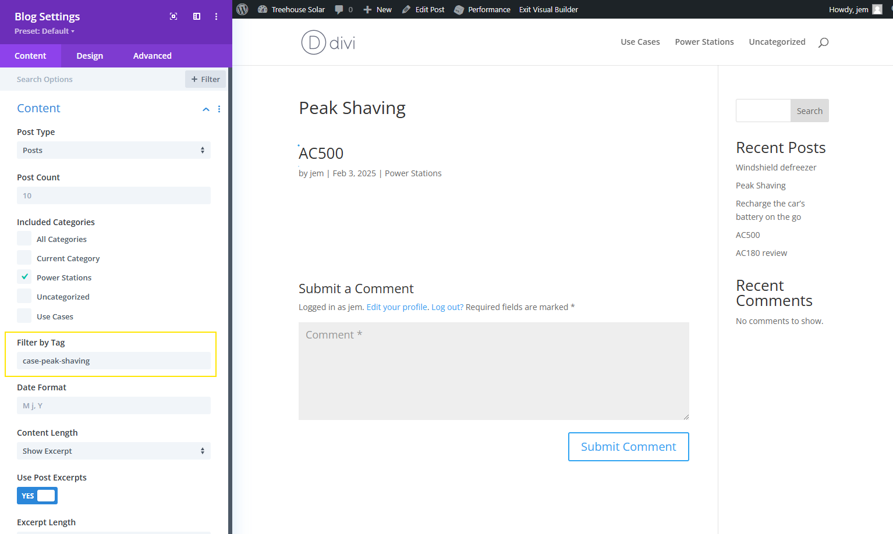

# Divi Blog Module Customization

For my website [Treehouse Solar](https://treehouse_solar), I needed the capacity to filter the Divi Blog module by both category and tag. This customization allows for more specific content display on various pages.

## Examples

### AC60's Review Page

- **Category**: `power-stations`
- **Tags**: Linked to use cases (e.g., `case-car-battery-recharge`)
- **Blog Display**:
  - Shows posts from the category `use-cases` with the tag `AC60`
  - Shows posts from the category `news` with the tag `AC60`

### Car Battery Recharge Page

- **Category**: `use-cases`
- **Tags**: `AC60` and other lightweight, portable power stations
- **Blog Display**:
  - Lists posts from the category `power-stations` where the tag `case-car-battery-recharge` is associated

## Future Updates

This is a quick and dirty first version. Future updates should include a checkbox system to easily assign tags without typos.

## Implementation

The changes were made to the following files:

- `/Users/jem/Desktop/workspace/divi-custom/wp-content/themes/Divi/includes/builder/module/Blog.php`

Look for comment `JEM` in order to locate changes brought to the original code.

These changes allow the Divi Blog module to filter posts by both category and tag, enhancing the content display capabilities of the website.
